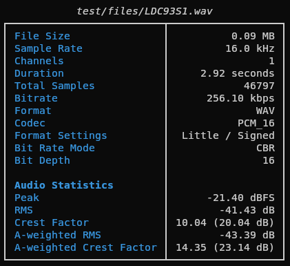
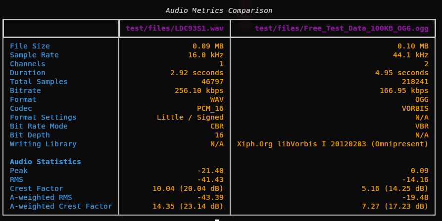

# audio_metrics

A command-line tool to compare audio/media files side-by-side, showing file metadata and audio statistics (RMS, peak, crest factor, A-weighted levels).

I wrote this because I wanted a quick way to check the sample rate, bit depth, and other properties of audio files, and to optionally compare them side-by-side. It can be useful for checking the output of audio processing scripts, or comparing different versions of a file.

## Running

Run directly from GitHub with uvx:

```bash
uvx --from git+https://github.com/martin-hunt/audio_metrics media_compare <input1> [input2] [input3] [--verbose]
```

Analyse a single file:

```bash
uv run python audio_metrics.py <input>
```

Compare two or three files:

```bash
uv run python audio_metrics.py <input1> <input2> [<input3>]
```

Show metadata tags (ID3, Vorbis comment, etc.):

```bash
uv run python audio_metrics.py <input1> <input2> --verbose
```

After `uv sync` the script is also available as an installed entry point:

```bash
uv run media_compare <input1> <input2>
```

## Running the tests

```bash
uv run pytest test/
```

## Example output

### Single file

```bash
uv run python audio_metrics.py test/files/LDC93S1.wav
```



### Comparison (two files)

Differences between files are highlighted in yellow in the terminal.

```bash
uv run python audio_metrics.py test/files/LDC93S1.wav test/files/Free_Test_Data_100KB_OGG.ogg
```



## Supported formats

| Format | Read | Tags |
|--------|------|------|
| WAV    | ✓    | ✓ (if ID3 embedded) |
| FLAC   | ✓    | ✓ (Vorbis comment) |
| OGG Vorbis | ✓ | ✓ (Vorbis comment) |
| OGG Opus   | ✓ | ✓ (Vorbis comment) |
| MP3    | ✓    | ✓ (ID3) |
